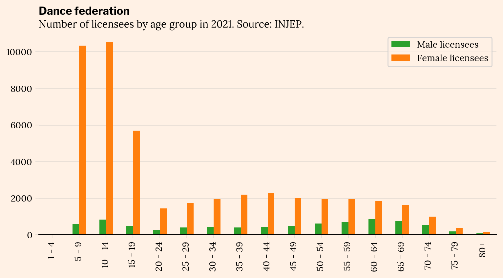
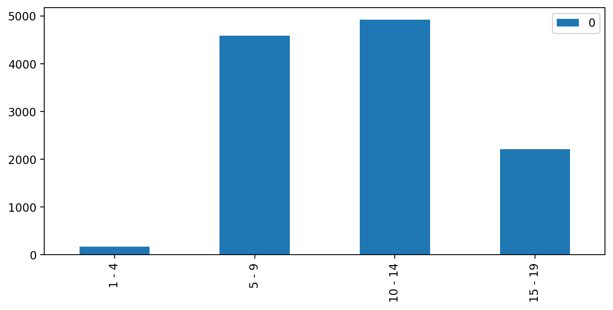

*Avez-vous vous aussi des problèmes lorsque vous faites des achats en magasin ou en ligne ? Des pénuries inexplicables, des produits "économiques" en promotion plus chers que les originaux, ou des conversations kafkaïennes avec les supports clients ?*

*J'ai la même expérience, et après quelques années d'expérience à la fois dans les secteurs de la data et du retail, chaque fois que cela se produit, j'essaie de comprendre ce qui a mal tourné, du côté business aussi bien que technique.*

Récemment, j'ai dû trouver une petite jupe rose pour ma fille qui rejoint un cours de danse classique.

Je me suis tourné vers mon magasin habituel pour tout ce qui concerne le sport - une célèbre enseigne spécialisé dans les articles de sport.

En bref, qu'est-il arrivé ?

- J'ai visité le même magasin pendant des semaines avant le début de l'année scolaire et elle n'était jamais en stock.
- Elle était disponible en ligne, alors je l'ai commandée avec d'autres articles pour être livrée dans mon magasin...
- Tout semblait bien se passer, mais les jupes roses n'ont pas été livrées : il s'est avéré qu'elles avaient été retirées de ma commande parce que l'entrepôt ne les avait pas...
- J'ai finalement dû faire un trajet de 50 minutes pour les trouver dans l'un des rares magasins qui avait une couverture de stock homogène des différentes tailles.

Tout cela nous offre une bonne occasion d'enquêter sur les problèmes commerciaux et de données :

1. La planification de la demande au niveau national et sa répartition par tailles.
2. L'équilibrage des stocks dans les magasins de ce détaillant.
3. Comment l'architecture autour du système de gestion des commandes a pu conduire à cette situation décevante.
4. Le lien manquant entre la gestion des commandes et la CRM pour gérer les problèmes de traitement des commandes.

# Planification de la demande

Mettais-vous à la place de la responsable d'approvisionnement travaillant avec son équipe de données sur la catégorie de produits "accessoires de danse". Quelle pourrait être son approche pour s'assurer que les stocks globaux pour chaque taille couvrent les besoins de l'ensemble du réseau de magasins français ?

Les tailles de jupette roses sont basées sur les âges : 3-4 ans, 4-5 ans, ... jusqu'à 13-14 ans, après quoi les filles commencent à choisir leurs vêtements dans les tailles adultes.

A quoi ressemble la répartition du nombre de petites danseuses par âge en France ?

Heureusement, l'INJEP (Institut National de la Jeunesse et de l'Éducation Populaire) collecte des données auprès des fédérations sportives et les publie en tant que données ouvertes.

Jetons un coup d'œil aux [données publiées par l'INJEP pour 2021](https://injep.fr/donnee/recensement-des-licences-et-clubs-sportifs-2021/) :

En se concentrant sur les enfants :

||Licenciés masculins|Licenciées féminines|
|---|---|---|
|1 - 4|1|**23**|
|5 - 9|571|**10327**|
|10 - 14|822|**10518**|
|15 - 19|485|**5692**|

Cela représente environ 21 000 pour toutes sortes de danses, pas seulement la danse classique. Nous pouvons raisonnablement supposer que les danseurs contemporains et de modern jazz ne portent pas de jupes en tulle rose.

Notre détaillant a probablement une meilleure idée du nombre total de robes roses qu'il peut vendre en un an. Notre préoccupation est davantage axée sur la répartition par tailles, alors faisons une hypothèse forte et simple selon laquelle environ 50 % des danseurs pratiquent la danse classique.

Cela nous donne un marché français de 10 000 robes roses dans des tailles allant de 4 à 15 ans.

L'INJEP ne fournit pas de données pour chaque âge (et à ce stade, la fédération française de danse 1. n'a pas répondu à ma demande de données 2. pense probablement que je suis fou), mais nous pouvons soupçonner que :

- Le nombre de licenciés commence assez fort à partir de l'âge de 5 ans ;
- La frénésie de danse atteint son pic vers 10 ans
- Ensuite, il y a une augmentation de l'attrition à l'approche et à l'entrée au lycée.

Mélangeons rapidement une distribution log-normale et une distribution binomiale, et cela pourrait ressembler à ceci :

Il semble correspondre aux données de l'INJEP si nous regroupons les âges de la même manière :

Cela semble être une première estimation raisonnable pour les commandes de production et la planification des stocks en entrepôt. Comment pensez-vous que cela se compare à la planification annuelle de ce détaillant ?

# Équilibrage des stocks

Poursuivons l'exercice en nous mettant à la place des équipes commerciales de ce détaillant. Nous ne savons pas si les articles sont poussés vers les magasins, tirés par les magasins, ou un mélange des deux en fonction des catégories de produits.

Pendant 3 à 4 semaines, depuis le début du mois d'août, je suis allé au même endroit dans le magasin pour vérifier les produits disponibles. Pendant 3 à 4 semaines, aucune taille disponible en dessous de 10 ans, presque toutes les jupes étaient pour les 13-14 ans.

Comment les stocks sont-ils équilibrés dans les différents magasins ?

J'aurais dû le faire beaucoup plus tôt, mais je viens de vérifier (le 13 septembre) les niveaux de stock dans 60 magasins, triés par distance croissante à partir d'un point que j'ai localisé arbitrairement :

Le magasin que je visite chaque semaine est le numéro 18. On dirait que je n'ai pas de chance car il fait partie des moins bien approvisionnés en jupes de danse rose.

Ce que nous voyons ici est très inhomogène.

- Certains magasins n'ont aucun stock du tout, mais cela pourrait être un choix basé sur l'emplacement et/ou la taille/concept du magasin. Faisons cette hypothèse.
- Sur 60 magasins, seuls 4 semblent avoir suffisamment de stock dans les tailles jusqu'à 8-9 ans (n° 1, 3, 21, 53, peut-être pourriez-vous ajouter n°27),
- Pour les jupes à partir de la taille 10-11 ans, il devient très difficile pour un client : les magasins après le n° 10 sont de plus en plus éloignés les uns des autres.
- Tous les autres magasins ont très peu de stock avec une distribution inhomogène des tailles, ce qui les rend inadaptés en tant qu'assortiment quotidien pour le reste de l'année scolaire.

En agrégeant tous ces magasins, et en supposant fortement que chaque magasin qui a 10 articles ou plus dans une taille a exactement 10 articles, cela donne les résidus de stocks agrégés suivants :

C'est dommage parce qu'en ce moment, dans toutes les écoles de danse de la région, les cours viennent de commencer, ou vont commencer, et littéralement toutes les petites filles ont leur jupe de danse. C'est plutôt inutile, mais vous savez, _les autres en ont une_.

Nous pourrions creuser beaucoup plus profondément si ce détaillant acceptait de révéler son identité :

- Estimer la zone de chalandise couverte par chaque magasin et le nombre correspondant de ménages.
- Obtenir des données sociodémographiques de l'INSEE sur la composition des ménages pour être plus précis sur le nombre d'enfants dans nos tranches d'âge cibles.

Lorsque vous êtes un détaillant d'articles de sport, les données des fédérations sportives sont de l'or pur pour la sélection de l'assortiment et la planification des commandes ! Cela aiderait à aller plus loin et à :

- Obtenir des données géolocalisées sur le nombre de licenciés dans chaque fédération.
- Établir des corrélations entre les données des licenciés, les données sociodémographiques et les ventes pour déterminer où ce détaillant est l'adresse de référence pour l'obtention d'articles de sport, et où, par exemple, les parents iront plus probablement chez Repetto ou dans un magasin discount tout-usage.

Voyez comment les modèles de licenciés selon les âges peuvent différer pour différents sports... et cela concerne déjà des données agrégées sur l'ensemble du pays :

Tirer parti de toutes ces données aiderait à construire une estimation beaucoup plus robuste pour le réseau de vente au détail physique :

- Moins de ventes ratées
- Moins de produits à rotation lente en stock
- ... et plus de stock disponible pour le commerce électronique !

# Gestion des commandes

Et c'est la dernière partie de notre enquête : comment ai-je pu commander des jupes sur le site web s'il n'y avait pas de jupe disponible pour la vente en ligne ?

En théorie :

- Les données de disponibilité des stocks devraient être alimentées en temps réel dans le canal de vente (ici, la partie commerce électronique) via le logiciel de gestion des commandes, de sorte que je ne puisse même pas commander un article indisponible en premier lieu.
- Les commandes de vente devraient être envoyées en temps réel au système de gestion des entrepôts, de sorte que les articles commandés soient immédiatement réservés/envoyés à la zone d'expédition... et par exemple ne sont pas utilisés pour satisfaire les commandes des magasins. (C'est là que des quotas peuvent être impliqués.)

Qu'est-il arrivé ici ?

- Les données de disponibilité des stocks publiées par le WMS vers le OMS, puis par le OMS vers le front-end de commerce électronique, étaient peut-être âgées d'un jour ou plus. Un travail par lot quotidien ?
- L'état de traitement des commandes, également publié par le WMS vers le OMS, puis par le OMS vers le front-end de commerce électronique, a mis 4 jours à arriver dans mes e-mails après ma commande !

# Gestion d'événements et CRM

Avez-vous dit des silos ?

Il semble y avoir un maillon manquant entre la gestion des commandes et le marketing, ainsi qu'un scénario CRM manquant.

J'ai reçu deux e-mails concernant ma commande :

1. Le 26 août : "Votre commande est confirmée !", avec les jupes apparemment disponibles
2. Le 30 août : "Votre commande est disponible en magasin !", commençant par les lignes :
    - "Elle vous attend !"
    - "État de la commande : disponible"

Entre ces deux e-mails, il n'y avait pas d'alerte disant "Cher client, nous sommes vraiment désolés, mais quelque chose s'est mal passé de notre côté".

Les seules informations étaient parfaitement alignées sur l'état, correctement structurées pour correspondre à la réalité technique. Mais elles ne faisaient pas ressortir ce qui était important pour moi, en tant que client, et ne me fournissaient pas les informations que j'aurais aimé avoir :

- Il y avait un problème du côté du détaillant
- Ma carte n'a été débitée que pour les articles livrés, ou mon argent a été remboursé
- Idéalement, il y aurait eu une solution hybride, à longue traîne, pour satisfaire ma commande à partir des stocks d'autres magasins

Les équipes logistiques travaillent-elles avec les équipes CRM pour élaborer un scénario de gestion des commandes non exécutées tandis qu'un projet visant à rendre l'information sur la disponibilité plus sécurisée est en cours ?

C'est tout pour aujourd'hui ! J'ai mis l'accent sur une expérience particulière avec un détaillant particulier, mais je pense que ce genre de problème se produit dans de nombreuses entreprises B2C.

Partant d'une mauvaise expérience client, nous avons pu aborder :

- La planification de la demande et les données à ingérer et analyser pour le faire
- L'équilibrage des stocks, et encore une fois, les données qui pourraient être exploitées
- Les problèmes d'architecture et d'implémentation possibles dans la gestion des commandes
- La communication incorrecte des événements importants pour les clients entre les équipes logistique et marketing

J'espère que cet exemple a montré comment chaque problème est à la fois un problème business et data, et comment la réalisation de l'excellence opérationnelle est un objectif pour les deux... ensemble.

Si vous êtes un décideur business ou data et que vous pouvez relier ces problèmes à certains des vôtres, n'hésitez pas à me contacter !