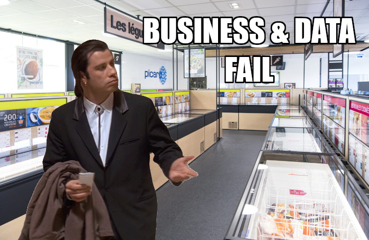
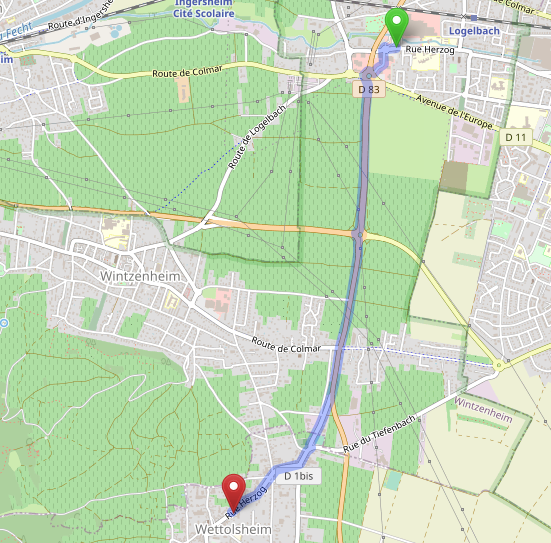

*Dans l'article Business & Data Discovery sur Picard Surgelés publié ce lundi, j'ai laissé pour plus tard un focus sur les erreurs dans le parc de magasins. L'idée n'est pas de s'attarder dessus - ça arrive dans toutes les organisations - mais de s'en servir pour illustrer une problématique que l'on retrouve partout : la gestion des données maîtres, en anglais Master Data Management.*

Pour aller vite, le parc de magasins Picard Surgelés, tel qu'il est rendu visible par son pendant numérique sur le site https://magasins.picard.fr, a les défauts suivants :
1. Des **données de localisation erronées**, sur des cartes qui plus est
2. Des **adresses imprécises** ou non normées (cause principale semble-t-il de (1))
3. Plusieurs magasins sont des **doublons**
4. L'ensemble des magasins n'est pas visible (mais il s'agit d'un défaut de navigation)

On reviendra en fin d'article sur des astuces qui ont permis de relocaliser certains magasins pour conduire l'analyse de l'article de lundi, parce qu'elles peuvent intéresser les équipes Picard Surgelés a posteriori - mais cela n'apporte rien au propos d'aujourd'hui.

# Assurer la qualité de ses données maîtres impacte les opérations toutes les équipes

Les données maîtres sont bien souvent des données fondamentales que se partagent toutes les parties prenantes d'une entreprise, chacun avec son angle propre : les produits et leurs attributs, les magasins et leurs attributs, les clients, les employés, les fournisseurs, les revendeurs, la structure financière du groupe...

Le parc de magasins et les attributs associés (localisations, horaires d'ouvertures...) est consommé par, au moins :
1. Les clients, pour des raisons évidentes
2. Des partenaires permettant de faire connaître l'enseigne, comme... Google
3. Les fournisseurs et les livreurs, qui géolocalisent leurs flottes pour leur propre tracking
4. Le marketing, qui peut chercher à cibler certains magasins pour ses campagnes
5. L'offre et le merchandising, qui peut chercher à spécialiser ses assortiments par magasin sur la base d'informations très localisées : informations socio-démographiques, points d'intéret, environnement compétitif, transports en commun, flux véhicules et piétons...
6. Les équipes logistiques, qui dans le cadre de leurs prévisions de volumes ont besoin des caractéristiques ci-dessus pour alimenter leurs modèles
7. Le pricing, qui peut lui aussi chercher les mêmes informations pour adapter localement les prix
8. Le contrôle de gestion et tous les analystes de toutes les directions précédentes qui doivent pouvoir être alignés sur le nombre de magasins qui étaient ouverts à un instant t.
# Des données maîtres de qualité sont les fondations pour des cas d'usage avancés

Les exploitations avancées des données de localisation par les équipes marketing, merchandising, offre, logistique, pricing, font généralement appel à des outils dits GIS (*Geographic Information Systems*) et à des outils issus de la data science et du machine learning. (Vous ne me verrez pas vous lancer à la figure le terme d'IA à tout bout de champ.)

Ces exploitations avancées reposent sur l'utilisation de données externes ou internes, rapportées à chaque magasin et croisées entre elles, pour apporter des explications, des éclairages sur les modes de consommation, et donc alimenter de nouvelles directions stratégiques et leurs déclinaisons opérationnelles.

Certains outils du marché, ou les équipes data en propre, peuvent apporter ces insights et recommandations aux équipes métier, et sont attendues là-dessus... mais concentrés sur les attentes on en oublie souvent les prérequis : des données d'entrée fiables parce que... gouvernées.

On vient de lâcher un très gros mot, souvent mal compris, qui va mériter pas mal d'articles. La traduction irréfléchie de l'anglais n'aide pas. Disons que gouverner les données c'est : être celui ou celle qui s'en préoccupe.
# Ceux qui peuvent "se préoccuper" de la qualité des données de parc ne sont pas ceux qui les utilisent

Le grand défi pour les enseignes, c'est de réussir à maintenir une source unique de vérité concernant son parc de magasins. On parle bien souvent de vision unique du client, très souvent de référentiel produit, mais pas si souvent du référentiel des points de vente.

Et pourtant, on devrait. On l'a dit, tout le monde exploite les informations du parc, chacun avec sa propre vision, sauf peut-être... les équipes qui les renseignent.

Bien souvent, et c'est parfaitement légitime, le premier "owner" de la donnée de localisation et ses interlocuteurs directs : chargé d'expansion, responsable de chantier, directeur de magasin, ont déjà une connaissance assez fine de l'environnement local, et leur préoccupation c'est uniquement de communiquer à l'un de ces interlocuteurs comment retrouver le magasin.

Cela donne des adresses du type 

* "Rond point pariwest Face au centre commercial auchan"
* "Route de bordeaux ccial leclerc les portes du bassin En face de la station essence"

Ca doit être de ma génération, mais pour vous faire sourire un instant, ça me rappelle toujours ce sketch de Chevallier et Laspalès (sorry english-speaking world) :

<iframe width="560" height="315" src="https://www.youtube.com/embed/0CU4xOewTVk?si=0DLsAJbapEoS0sTI" title="YouTube video player" frameborder="0" allow="accelerometer; autoplay; clipboard-write; encrypted-media; gyroscope; picture-in-picture; web-share" allowfullscreen></iframe>

# Les défauts rencontrés sur le parc Picard Surgelés et quelques astuces pour les retrouver

**1. Lister tous les magasins**

Petit problème de navigation sur la [page de recherche des magasins](https://magasins.picard.fr/search?country=fr&geo=&lat=&lon=&page=5&query=) : l'indexation est limitée à 50 pages x 20 magasins par pages = 1000 magasins ! En jouant avec les filtres sur les Services, on peut en retrouver... 1105 sur les 1110.

**2. Dédoublonner les magasins**

Simple mais nécessaire : les magasins 763/764, 821/822, 922/923 sont identiques. Changement de propriétaire et ancien code toujours actif ?

**3. Localiser les magasins listés**

Dans certains cas, les magasins n'étaient pas du tout présentés à la bonne adresse par les mini-cartes du site Picard Surgelés. Par exemple, [le magasin de Wintzenheim](https://magasins.picard.fr/1023-picard-wintzenheim) est localisé sur le site à... Wettolsheim, 3,4 km au sud de l'emplacement réel du magasin !

Pour tous les magasins qui avaient des adresses complètes avec des numéros de rue, 745 magasins, ça s'est bien passé, et ils ont globalement été retrouvés par l'[API Adresse](https://adresse.data.gouv.fr/api-doc/adresse) de la [Base Adresse Nationale](https://adresse.data.gouv.fr/).

Ensuite, pour 202 des 352 restants, qui avaient été positionnés seulement de manière approximative dans la rue ou la commune, ils ont pu être associés avec des bâtiments précisément localisés dans la carte collaborative OpenStreetMap. Il est bon de savoir qu'une part significative des localisations provient du [cadastre publié en open data par la Direction Générale des Finances Publiques](https://cadastre.data.gouv.fr/).

Au global, on a donc 745 + 202 + 5 = 952 magasins localisés précisément sur les 1102. Ouf !

La carte finale est [ici](parc_picard.html) !

En résumé :

| Groupe       | Effectif        |
|--------------|-----:|
| **Total parc annoncé** | **1110** |
| Identifiables sur le site | 1105 |
| dont doublons (821/**822**, 763/**764**, 922/**923**) | 3
| dont Dédoublonnés | 1102 |
| → dont Non localisés par l'API Adresse, localisés à la main | 5 |
| → dont Localisés par l'API Adresse| 1097 |
| → → dont Localisés au numéro de rue (*housenumber*) par l'API Adresse | 745 |
| → → dont Localisées à la rue ou à la commune (*street*, *locality*) par l'API Adresse | 352 |
| → → → dont Retrouvés au bâtiment par proximité avec OpenStreetMap | 202 |
| → → → dont Conservés avec une localisation approximative | 150 |

---

C'est tout pour aujourd'hui ! Un grand merci aux mainteneurs des bibliothèques GIS open source, aux contributeurs de la communauté OpenStreetMap et à la DGFiP pour, encore une fois, une publication open data qui, comme celles de l'INSEE ou d'autres administrations, est d'une valeur inégalable pour qui sait les exploiter.

Est-ce que cet article vous rappelle la gestion des données maîtres dans votre propre organisation ? Votre propre parc de points de vente ? N'hésitez pas à me suivre et me contacter sur LinkedIn, ou à m'écrire sur gansanay AT gmail DOT com.

