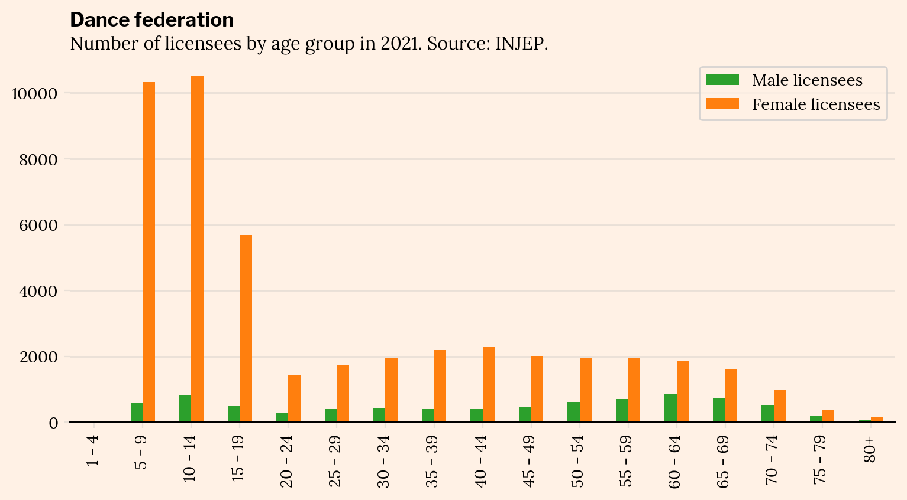
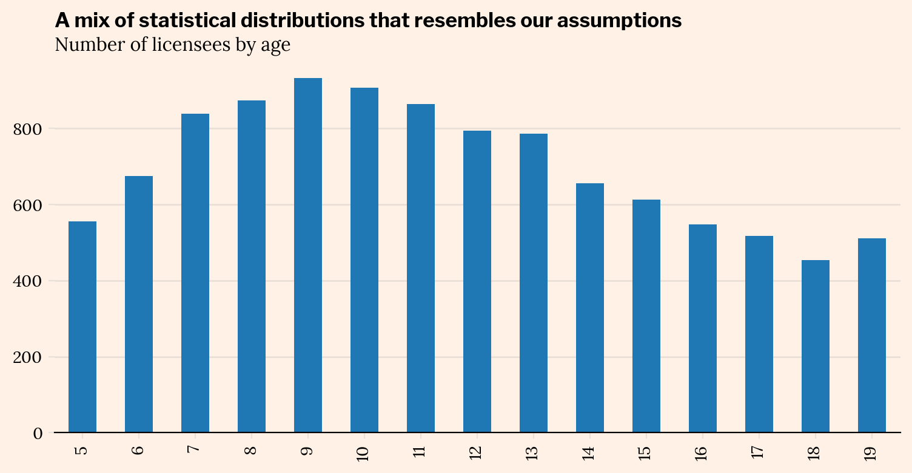
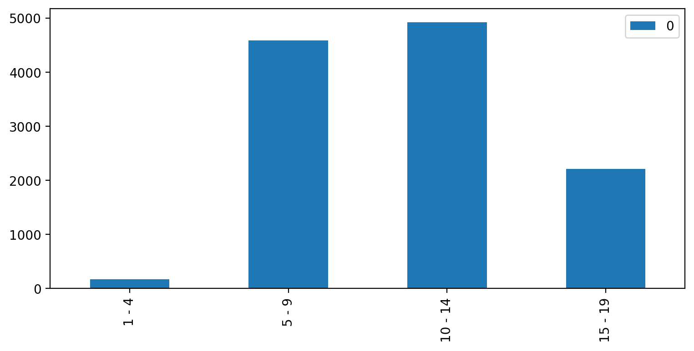
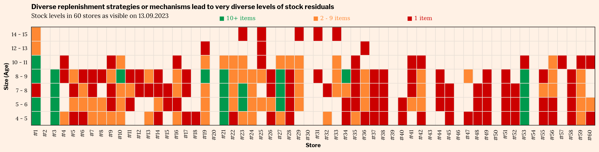
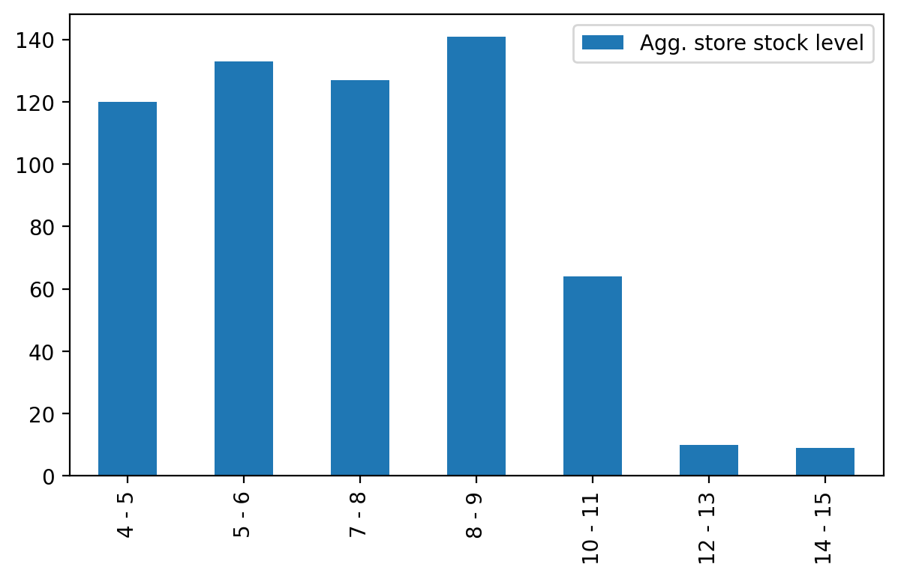
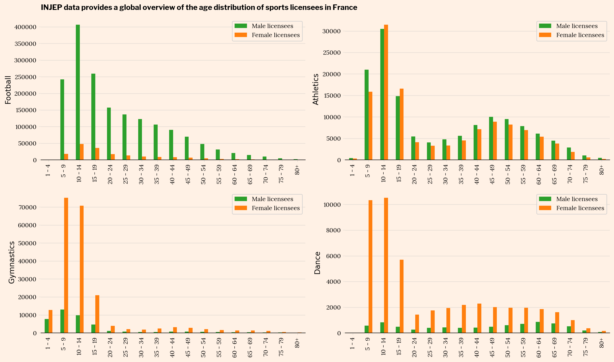
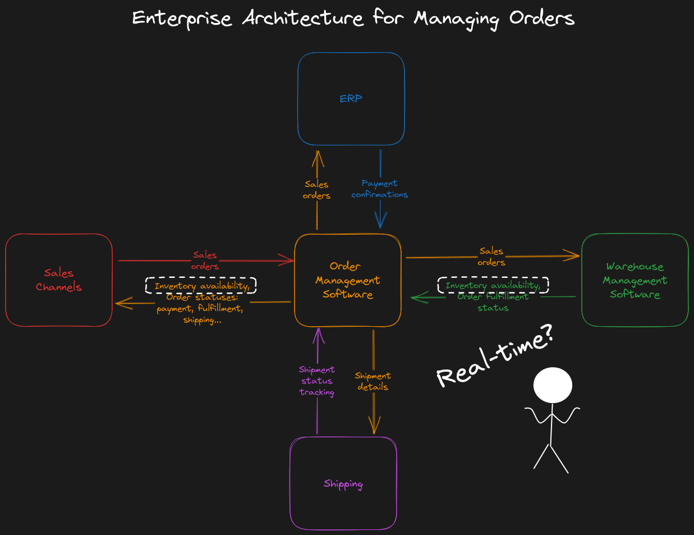

Don't you know those issues when you are shopping offline or online? Inexplicable shortages, "economic" / marked down products that are more expensive than the original ones, or Kafkaïan conversations with support after a failed digital sale?

I have the same, and as an experienced data practitioner in the retail field, every time it happens I try to understand what has gone wrong, on the business side as well as the technical/data side of things.

Recently, I had to find a little pink skirt for my daughter who is joining a classical dance course.

I turned to my usual go-to store for everything related to sport - an international retailer specialized in sport items.

In short, what happened?

* I have been visiting the same store **for weeks before the start of the school year** and **it was never in stock**.
* **It was available online**, so I ordered it along with other items to be delivered in my store...
* Everything seemed ok but **the pink skirts were not delivered**: it turned out that they were removed from my order because **the warehouse didn't have them**...
* I finally had to do a **50 minutes ride to find them** in **one of the few stores that had an homoegeneous stock coverage** of the different sizes.

All of this provides us a nice setup to investigate business & data issues:
1. **demand planning** at the national level and its breakdown in sizes
2. **stock balancing** in this retailer's stores
3. how the architecture around the **order management system** may have led to this disappointing situation
4. the **missing link between order management and CRM** to handle order processing issues

# Demand Planning

Let's put ourselves in the shoes of the supply manager working with her data team on the Dance accessories product category. What could be her approach to ensure that the overall stocks for each size covers the needs of the whole French stores network?

Little pink skirt sizes for children are based on ages: 3-4 years, 4-5 years, ... up until 13-14 years, after which girls start to pick their clothes in the adult sizes.

What is the pattern of the number of little dancers by age in France?

Luckily, the INJEP (institut national de la jeunesse et de l’éducation populaire) collects data from sports federations and publishes them as open data.

Let's have a look at [the data published by the INJEP for 2021](https://injep.fr/donnee/recensement-des-licences-et-clubs-sportifs-2021/):

Focusing on children:

|             |   Male licensees |   Female licensees |
|:------------|----------------------:|---------------------:|
| 1 - 4   |                     1 |                   **23** |
| 5 - 9   |                   571 |                **10327** |
| 10 - 14 |                   822 |                **10518** |
| 15 - 19 |                   485 |                 **5692** |

That is around 21K for all kinds of dance, not only classical. We can safely assume that contemporary and modern jazz dancers are not wearing pink tulle skirts.

Our retailer probably has a better idea of the total number of pink dresses it can sell in a year. Our concern is more focused on the breakdown in sizes, so let's make a strong an simple hypothesis that around 50% of dancers are classical dancers.

This gives us a French market of 10K pink dresses in sizes ranging from 4 - 5 y. to 14 - 15 y.

INJEP is not providing data for every age (and by now the french dance federation 1. hasn't responded to my data request 2. probably thinks I am crazy), but we can suspect that:

* licensee numbers start quite strong at the age of 5;
* peak dance frenzy is around 10
* then there is a growing churn when getting closer to and entering high school

Let's quickly mix a log-normal distribution and a binomial distribution and it could look like this:

It seems to fit the INJEP data if we bin ages the same way:

It looks like a reasonable first guess for production orders and planning warehouse stocks. How do you think it compares to this retailer's yearly planning?

# Stock balancing

Let's continue the exercise of putting ourselves in the shoes of this retailer's business teams. We don't know it the items are pushed to stores, pulled by stores, or a mix of both depending on product categories.

For 3-4 weeks, since the beginning of August, I have been going to the same place in the store to check the available products. For 3-4 weeks, no available size under 10 y.o, nearly all skirts were for 13-14 y.o.

How are stocks balanced in the various stores?

I should have done it much sooner but I just checked (Sep 13th) the stock levels in 60 stores, sorted by increasing distance from a point I located arbitrarily:

The store I visit every week is number 18. It looks like I have no luck because it is one of the least stocked in terms of pink dance skirts.

What we see here is very inhomogeneous.

* Some stores don't have any stock at all, but this might be a choice based on location and/or the size/concept of the store. Let's make this assumption.
* Over 60 stores, only 4 seem to have enough stock in sizes up to 8 - 9 (n° 1, 3, 21, 53, maybe you could add n°27),
* For skirts starting at size 10 - 11, it becomes very difficult for a customer: stores after n°10 are becoming much farther from each other.
* All other stores have very few stock left with an inhomogeneous distribution of sizes, which makes it unsuitable as a day-to-day assortment for the rest of the school year. 

Aggregating on all of these stores, and making the strong assumption that every store which has 10+ items in one size has exactly 10 items, this gives the following aggregated store stocks residuals:

That's a pity because these days, in all dance schools in the region, courses have just started, or are starting, and literally every little girl has her dance skirt. It is rather useless but you know, *the others have one*.

We could dig much deeper if this retailer agreed to reveal its identity:
* estimate the trade area covered by each store and the corresponding number of households
* get sociodemographic data from INSEE about household compositions to be more precise on the number of children in our target ages

When you are a sports retailer, sports federations data is pure gold for assortment selection and order planning! It would help go further and:
* get geolocalized data about the number of licensees in each federation
* build correlations between licensees data, sociodemographical data and sales to determine where this retailer is the go-to address for getting sport items, and where for example parents will more likely go to either Repetto or a discount all-purpose store.

See how the patterns of licensees over ages can differ for various sports... and this is already aggregated data over the whole country:

Getting advantage from all these data would help build a much more robust estimate for the physical retail network:
* less missed sales
* less slow movers in store stocks
* ... and more stock available for e-commerce!
# Order Management

And that is the last part of our investigation: how could I order skirts from the website if there was no available skirt for e-commerce sales?

In theory:
* **inventory availability data should be fed in real-time** to the sales channel (here, the e-commerce part) through the Order Management Software, so that I could not even order an unavailable item in the first place
* **sales orders should be sent in real-time to the Warehouse Management System** so that ordered items are immediately reserved/sent to the shipment area... and for example are not used to fulfill pull orders from stores. (That's where quotas may be involved.)

What happened here?
* The **inventory availability data** published by the WMS to the OMS and then by the OMS to the e-commerce front-end was possibly one or more days old. A daily batch job?
* The **order fulfillment status**, also published by the WMS to the OMS and then by the OMS to the e-commerce front-end, took 4 days to get into my e-mails after my order!

# Event management and CRM

Did you say silos ?

There seems to be a missing link between order management and marketing, and a missing CRM scenario.

I received two e-mails about my order:
1. August 26th: "Your order is confirmed!", with the skirts seemingly available
2. August 30th: "Your order is available in store!", starting with the lines:
	* "It's waiting for you!"
	* "Order status: available"

After this, who would scroll until the end of the e-mail to see a section named **Missing items**?

Between these two e-mails, there wasn't an alert saying "Dear customer, we're really sorry but something wrong happened on our end".

The only informations were perfectly aligned with the status, correctly structured to fit the technical reality. But it didn't surface what was important for me, the customer, and didn't provide me the informations I would have liked to have:
* there was an issue on the retailer's end
* my card was only charged for delivered items, or my money was sent back
* ideally, there would have been an hybrid, long tail solution to fulfll my order from stocks in other stores

Do logistics teams work with CRM teams to build a scenario for handling unfulfilled orders while a project for making the availability information more secure is underway?

That's all for today! I focused on one particular experience with one particular retailer but I think this kind of issue happens in lots of B2C companies.

Starting from one bad customer experience, we uncovered:
* demand planning strategy and the data to be ingested and analyzed to help
* balancing and again, the data that could be leveraged
* possible architectural and implementation issues in order management
* mis-communication of important customer events between two units

I hope this example showed how every issue is at the same time a business and data issue and how making operational excellence a reality is a goal for both of them, together.

If you are a business leader or a data leader and you could relate theses issues with some of your own, feel free to reach out!

