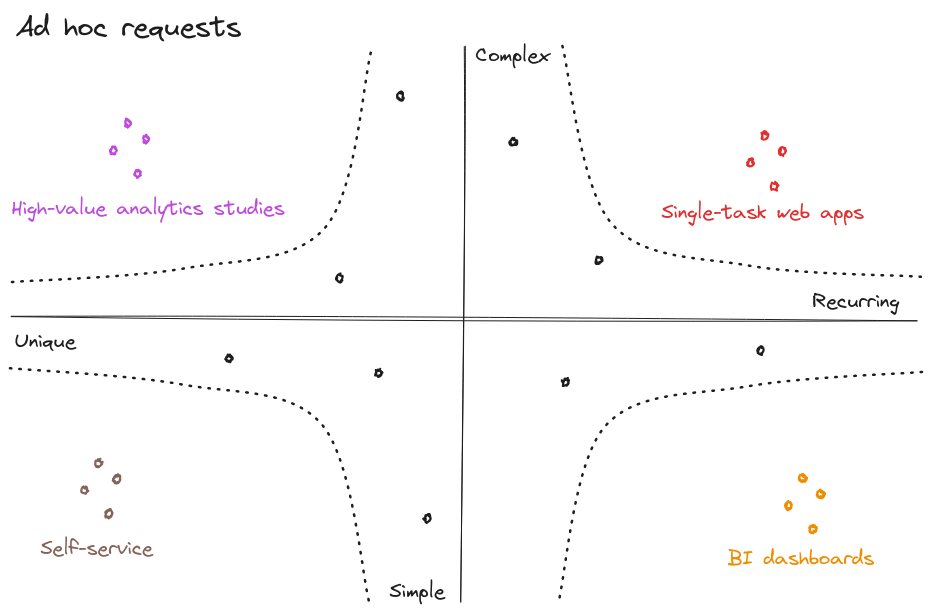
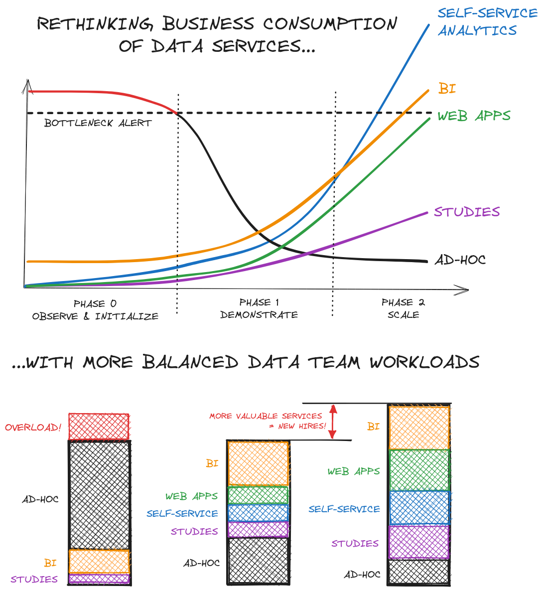
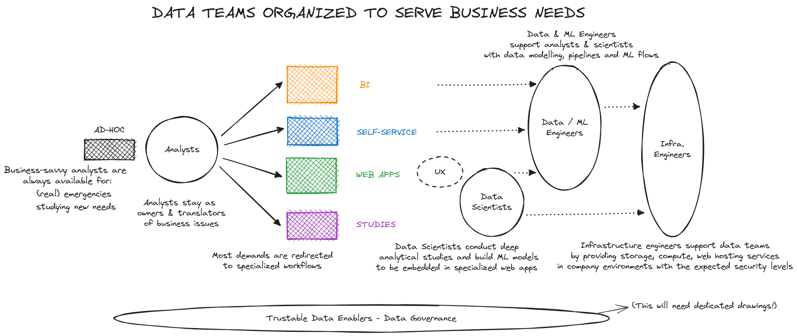
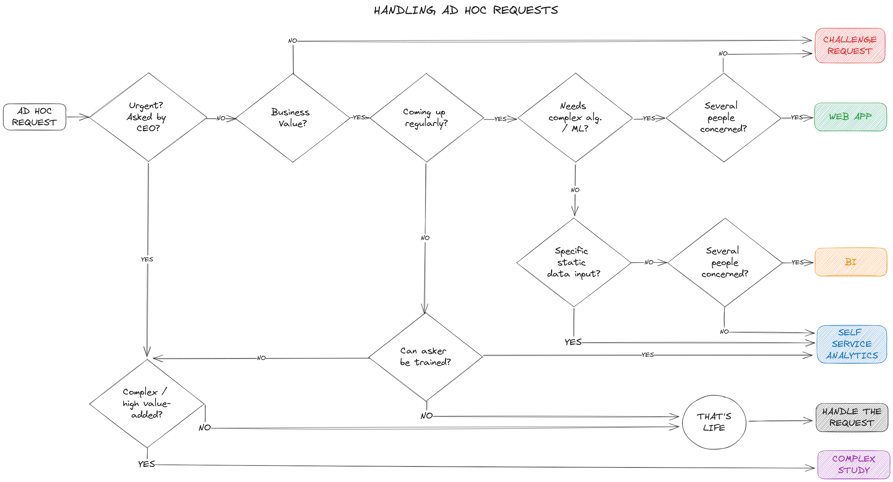

Avez-vous remarqué que :

* Les équipes data se plaignent des demandes ad hoc qui les submergent.
* Les mêmes équipes data cherchent des idées pour créer de la valeur business et se demandent comment s'organiser pour la délivrer.

Face à ça, je trouve que l'on dégaine beaucoup (trop) le self-service comme une solution miracle, pour "sortir des demandes ad hoc et enfin faire des cas d'usage avancés". Comme si on ne voulait plus entendre parler du métier tant qu'il s'agit de l'opérationnel, du quotidien, et se consacrer à son grand oeuvre, le fameux *use case* qui serait hors de portée des métiers sans la data.

Selon moi, c'est faire gravement fausse route. Je passe mon temps à le dire à qui veut bien l'entendre : si on ne commence pas par coller au plus près des opérations et du quotidien du métier, aussi difficile que cela puisse paraître, on fait fausse route.

Ce qui ne veut pas dire que le self service n'est pas à la fois utile et nécessaire au métier - mais pas systématiquement.

Je vais même plus loin : l'écoute des besoins business, notamment par le biais des demandes ad hoc, est **indispensable** à la construction d'une organisation data qui soit un véritable partenaire.

Mais comment alors résoudre cette contradiction apparente ? 

Comment accueillir la diversité et le nombre des demandes, tout en évitant d'être surchargé ou de devenir un goulet d'étranglement, une limite au time to market ? 

Comment diminuer le temps passé à traiter les demandes quotidiennes du métier, tout en conservant une exposition suffisante à ses enjeux pour alimenter des solutions à forte valeur ajoutée qu'en effet seule la data et son traitement algorithmique peut apporter ?

C'est le sujet d'aujourd'hui, et nous allons commencer par nous pencher sur la nature des demandes qui nous arrivent.
# Quatre typologies de demandes ad hoc

Regardons plus en détail les demandes, et répartissons-les en fonction de leur **récurrence** et de leur **complexité** :

Quatre types de demandes apparaissent :

* Les requêtes *répétées* et *simples* sont à intégrer dans les **outils de BI**. 

Exemple : *est-ce que la dernière collection d'accessoires femme se vend aussi bien que l'année dernière à la même date ?*

* Les requêtes *uniques* et *simples* sont de bons candidats pour apprendre aux utilisateurs à être autonomes via des **analyses en self-service**.

Exemple : *extraire le nombre de transactions web payées avec des chèques-cadeaux depuis le 1er juillet, ou le nombre de magasins ayant détenu plus de 8 semaines d'affilée hors soldes les noeuds papillons de la marque Y.*

* Les requêtes *répétées* et *complexes* sont des prototypes d'**applications data dédiées**.

Exemple : *préconiser l'assortiment ou le niveau tarifaire d'un nouveau point de vente*

* Les requêtes *uniques* et *complexes* sont l'occasion d'**études à forte visibilité et valeur ajoutée**.

Exemple : *découvrir les causes d'une tendance baissière, déterminer si elle est structurelle ou conjoncturelle, et les facteurs d'exposition à cette tendance*

Une remarque en passant : équipes data, si vous recevez des demandes complexes commes les deux dernières, réjouissez-vous ! Ce genre de questions est le signe d'une confiance du métier dans son équipe data, à vous d'être à la hauteur !

# Pour sortir la tête de l'eau : mutualiser

Disons que vous prenez la direction d'une équipe data qui est sous l'eau : les métiers n'en peuvent plus et se plaignent de l'absence de réactivité de votre équipe, vos data scientists en ont assez de ne faire que du SQL et se rêvent dans une boîte de big tech... alors que vous, vous savez qu'il y a de beaux problèmes à craquer.

Comment est-ce qu'on se sort de là ? Il n'y a pas une réponse unique, et toutes les situations seront différentes.

* Inutile de faire l'autruche
* Inutile de demander des ressources supplémentaires
* Inutile d'ouvrir les accès à toutes les données brutes pour déclarer le self-service ouvert, puis de se consacrer à un use case d'IA hors sol. Un esprit sensé devrait vous arrêter avant.

La solution est itérative, via un travail progressif alternant création de valeur et consolidation de votre plateforme data :

<figure><figcaption style="margin-top: 0px"><em>3 étapes pour faire évoluer le traitement des demandes d'une équipe data</em></figcaption></figure>

## Phase 0 : observation, initialisation

Dans la majeure partie des cas, un premier ensemble des données les plus immédiates, à l'état brut, est déjà déversé dans un Data Lake, ou normalisé dans un Data Warehouse.

On va à partir de là répéter deux étapes :

* Une étape de data analytics : en observant les demandes ad hoc, il vous est possible d'identifier des motifs, qui probablement se traduisent déjà en code dupliqué dans le traitement des différentes demandes.
* S'ensuit une étape de data engineering, qui va définir les agrégats à construire, les nouvelles données à acquérir, pour constituer un premier ensemble de tables orientées vers l'**usage** : d'abord pour alléger et fiabiliser le travail sur les prochaines demandes ad hoc, et très vite pour alimenter la BI, le self-service analytics.

Dès cette étape, les premiers éléments de CI/CD, d'orchestration, et de premiers tests devraient être en place.
## Phase 1 : démonstration

Répéter ces deux étapes va amener graduellement à avoir une plateforme data plus riche, qui permet de répondre plus rapidement à un nombre croissant de besoins, et donc permet de dégager de la bande passante.

Cette bande passante va permettre de :
* multiplier les tables mises à disposition en self service : des données résultant de pipelines correctement testés, que les métiers peuvent ensuite ré-exploiter avec des risques d'erreurs minimisés
* développer des dashboards BI répondant à de plus en plus de questions simples
* mettre en place, avec le soutien des équipes infrastructure, de premiers cas d'usage de web apps dédiées à certaines questions complexes

A l'issue de cette phase, les premiers éléments de démonstration d'une offre de services data complète sont en place et apportent de la valeur en accélérant ou en optimisant les décisions.

Au cours de cette étape, d'autant plus que l'on va commencer à utiliser plus de compute et de services web, on devrait commencer à poser les bases en termes de monitoring, d'observabilité, aussi bien du point de vue du maintien en service que des coûts : bonnes pratiques, optimisation des requêtes, stratégie de tests raisonnée mais suffisante. Si les web apps embarquent du machine learning, là encore il faudra poser les bases de la gestion et du suivi des modèles : monitoring des indicateurs, ré-entraînement...

Cette valeur apportée va permettre de justifier un passage à une équipe un peu plus conséquente, qui va commencer à se spécialiser pour offrir et maintenir ces différents services à plus grande échelle.
## Phase 2 : passage à l'échelle

L'offre devenant plus large, l'exposition va devenir plus large, les attentes plus fortes... mais aussi l'impact !

C'est au cours de la phase 1 et de la phase 2 que les bases techniques auront été posées. Il s'agit à présent de rentrer dans une industrialisation et un passage à l'échelle qui vont permettre de s'orienter plus fortement encore vers le métier, tout en assurant un maintien de la qualité de service :

* L'effort du **CDO** va se porter vers un soutien de plus en plus fort à la stratégie business, notamment par l'accompagnement de plus de directions métier.

* L'effort, et donc l'effectif d'**analystes**, est celui qui doit pouvoir le plus croître avec la maturité et le nombre des besoins : c'est là que la rencontre entre métier et technique a lieu, c'est par là que tout commence !

(Le sujet n'est alors plus nécessairement de recruter uniquement des analystes centralisés dans l'équipe data, mais d'identifier et/ou de recruter des analystes dans chaque direction métier, pour aller vers un modèle *hub and spoke* avec un centre d'excellence central et des ambassadeurs.)

* L'effort des **data engineers** va de plus en plus se porter sur la maintenance, le monitoring d'un nombre croissant de pipelines et produits

* Les **data scientists** vont pouvoir progresser sur deux axes : 
	* d'une part, mener un travail de fond, prospectif, pour identifier des méthodes innovantes, enrichir les données d'entrée de leurs modèles, 
	* d'autre part, augmenter leur exposition à la fois aux métiers et aux data engineers pour imaginer, proposer et concevoir de nouvelles solutions.

En systématisant et en multipliant les développements des différents composants de votre offre de services, le temps de traitement des demandes ad hoc va diminuer, sans jamais disparaître. Plus important encore : menée de manière optimale, cette organisation va permettre de faire en sorte que les analystes, qui resteront toujours la porte d'entrée du système, aient toujours de la disponibilité pour répondre aux besoins et questions des métiers !
# Répartir les demandes et identifier des cas d'usage à forte valeur : un travail d'équipe

Comment s'y prendre pour répartir les demandes ? Pour la majeure partie d'entre elles, la décision pourra être relativement simple :

Pour les cas plus complexes, faites confiance au collectif : en abordant les demandes ensemble en réunion d'équipe, la solution se manifeste.

Parmi les multiples avantages de ce collectif :
* **partager une vision d'ensemble** des demandes permet de discerner des motifs et d'esquisser des produits à proposer aux métiers
* **partager les développements de chacun** permet de perfectionner l'architecture de la plateforme
* **partager les difficultés** liées à la qualité des données alimente les actions toujours à renouveler de gouvernance des données (sujet que j'effleure mais qui méritera des articles entiers)

Comme vous pouvez le voir, pour revenir à mon propos initial, plusieurs flèches du diagramme ci-dessus aboutissent au self-service. Elles correspondent aux cas, et uniquement aux cas qui à la fois résultent d'une demande de self-service et sont compatibles avec celui-ci.
Dans ces situations, à la fois côté métier et data, on acceptera donc que le métier puisse construire en toute liberté ses analyses, soutenu par le *knowledge management* et la gouvernance des données qui limiteront les risques.
A tout moment, les équipes métier concernées par ces développements en self-service pourront, soit parce qu'elles auront une question, soit parce qu'elles auront abouti à un résultat stable mais s'apercevront de la maintenance nécessaire, pourront passer la porte de l'équipe data.

---

C'est tout pour aujourd'hui !

Où en est votre organisation ? Phase 0, phase 1, phase 2 ? Parmi les différentes étapes et actions soulevées dans l'article d'aujourd'hui, laquelle vous semble la plus complexe à mettre en place ?

*Notez bien ! J'ai passé sous silence, ou à peine effleuré, beaucoup d'enjeux qui apparaissent sur ce chemin, notamment concernant la gouvernance des données. Mais je reste convaincu que la gouvernance et toute la comitologie qu'elle peut apporter dans une grande organisation, doit venir petit à petit, organiquement. Pour chaque nouveau besoin que l'on traite en exploitant les données, il y a un effort de gouvernance à apporter. Penser le cycle de vie de la donnée, identifier qui peut s'en occuper à chaque stade, juger de sa qualité... Il est plus simple de faire consensus petit à petit, d'évoluer à partir de là, que de chercher à tout cartographier avant de commencer à se rendre utile.*

Si je devais parler de la gouvernance / du knowledge management, quel sujet voudriez-vous que je traite en premier ?

Vos retours m'aident à choisir quels sujets aborder parmi tous ceux qui doivent l'être, n'hésitez donc pas à me contacter sur LinkedIn ou par e-mail : gansanay AT gmail DOT com.

