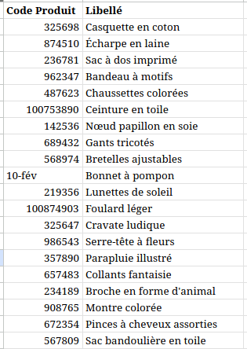

Est-ce que la conversation suivante vous parle ? Est-ce que vous vous reconnaissez dans le rôle d'Eva ou de Tom ?

      

        

          

            

              
  

              

                

                  
Hello Tom, j'espère que tu vas bien ! Je sors de copil marketing, on me demande de donner asap une vision sur les accessoires enfant de la nouvelle co

                  
Est-ce que tu peux m'extraire les données sur les produits de cette liste ? C'est urgent, tu penses pouvoir m'envoyer ça <b>avant midi ?</b>

                  
Merciii !!!!

                   11:01 AM

              

            

            

              
  

              

                

                  

                   11:01 AM

              

            

            

            
  

              

                
Salut Eva, de quelles données as-tu besoin ? Depuis quand ?

                 11:02 AM 

            

            

            
  

              

                
Tes codes produits ne sont pas très clean 🫤

                 11:02 AM 

            

            

              
  

              

                

                  
Magasin, produit, CA, volume, marge, # de magasins qui vendent le produit, on veut savoir aussi si ils les ont bien commandés

                   11:05 AM

              

            

            

            
  

              

                
Ca fait pas mal de choses ça Eva...

                 11:05 AM 

            

            

              
  

              

                
       
				
Je sais, mais vous êtes les pros de la data science 😉 Pour l'instant on va se débrouiller avec l'Excel brut, est-ce que pour la semaine prochaine tu pourrais mettre ça dans notre Excel de suivi ?

                   11:06 AM

              

            

          

                      

              
  

              

                

                  
Merciii !!!

                   11:07 AM

              

            

                        

              
  

              

                

                  
<figure style="width:75px"><figcaption>kpis_nvelleco_v3_def.xlsx</figcaption></figure>

                   11:10 AM

              

            

                        

            
  

              

                
On va voir ce qu'on peut faire, on revient vers toi.

                 11:10 AM 

            

        

              <em>Images by <a href="https://www.freepik.com/free-vector/hand-drawn-people-avatar-collection_4077376.htm#query=circle%20avatar&position=16&from_view=keyword&track=ais">Freepik</a></em>
      

C'est peut-être caricatural, mais pas si éloigné de la réalité. 

On appelle ça une **demande *ad hoc*** :

1. **Une question métier apparaît**, du fait de résultats récents, de la prise de conscience d'une tendance, d'un contexte commercial nouveau...
2. **Le métier la traduit** (plus ou moins bien) en un besoin de données
3. **Une demande d'extraction de données atterrit dans les équipes data** sous la forme d'une demande d'extraction, pas toujours contextualisée, et souvent mal vécue.

Et dans une grande organisation, ce genre de demandes inattendues est bien souvent quotidien !

<b>La position d'Eva n'est pas simple.</b>
* Le management d'Eva lui demande implicitement de fournir un regard critique sur les performances de la nouvelle collection. Elle a pu avoir quelques impressions et opinions personnelles de collaborateurs magasins, rien de plus, et elle ne sait pas quelles questions on va lui poser au prochain COPIL.
* Tom a accès aux données. Eva, elle, n'a peut-être qu'un accès limité à certains agrégats prédéfinis, via un outil qu'elle ne maîtrise pas. Ou n'a pas du tout accès à la donnée.
* Ses collègues lui ont dit que la data était là pour ça, donc elle demande.
* De plus, elle n'a pas trop de temps, parce qu'elle doit sortir un brief pour l'agence de communication d'ici 14h.

<b>Tom se retrouve également dans une situation très inconfortable.</b>
* Par définition, la demande n'a pas été planifiée.
* Elle est généralement urgente.
* Eva n'a pas conscience du nombre de sources convoquées par chacun des indicateurs demandés.
* Plusieurs hypothèses ne sont pas exprimées et peuvent amener à de mauvaises interprétations.
* Eva présente une liste statique de codes produits à prendre en compte. Sont-ils valides ? Vont-ils changer la semaine prochaine ?
* Eva n'a pas cherché à creuser la problématique métier avec Tom et l'empêche donc d'être plus pertinent et autonome pour la prochaine demande.

Le sentiment de Tom est donné par [Seth Rosen](https://twitter.com/sethrosen)  dans un tweet qui a été beaucoup repris dans la sphère data :

<blockquote class="twitter-tweet">
Them: Can you just quickly pull this data for me?  Me: Sure, let me just:   SELECT * FROM some_ideal_clean_and_pristine.table_that_you_think_exists
&mdash; Seth Rosen (@sethrosen) <a href="https://twitter.com/sethrosen/status/1252291581320757249?ref_src=twsrc%5Etfw">April 20, 2020</a></blockquote>
 

Qu'est-ce qui pourrait se passer après cette conversation ?
* Tom va, à contrecoeur, réaliser une extraction en faisant des hypothèses lui-même
* Eva va s'apercevoir que ce n'est pas tout à fait ce qu'il lui faut, et va demander à Tom de relancer l'extraction. Potentiellement plusieurs fois.
* La liste de codes produits va changer la semaine prochaine, et Tom va devoir implémenter un pipeline basé sur un fichier Excel plus ou moins bien maintenu manuellement
* Tom et ses collègues vont chercher à maîtriser ce genre de demandes en établissant une interface de description de demande qui va être incompréhensible pour le métier, va agrandir le fossé entre les deux équipes, et rendre la relation encore plus déshumanisée et transactionnelle. Peut-être Eva devra-t-elle avoir un code budgétaire à fournir pour que Tom puisse traiter sa demande.
* Eva n'aura plus vraiment envie de travailler avec la data et aura du mal à justifier leur valeur ajoutée.

Alors rembobinons, et imaginons une nouvelle conversation entre Eva et Tom :

      

        

          

            <!-- Incoming Message -->
            

  

            
Hello Tom, j'espère que tu vas bien ! Je sors de copil marketing, on me demande de donner asap une vision sur les accessoires enfant de la nouvelle co

            
Est-ce qu'on peut regarder ensemble ?

             11:01 AM
            

            <!-- Incoming Comment -->
            

  

            
<em>Eva propose de co-construire l'analyse avec Tom !</em>

            

            <!-- Outgoing Message -->
            

  

	        
Salut Eva, ok ! Est-ce que la direction a déjà précisé un axe de mesure ? Une collection à laquelle comparer celle-ci ? On a lancé une première collection enfant mais c'était une collab, je ne sais pas si c'est une bonne référence.

             11:02 AM
            

            <!-- Outgoing Comment -->
            

  

            
<em>Tom ayant déjà pu être impliqué dans le suivi de précédentes collections, il fait preuve de <b>business literacy</b>, aide Eva à spécifier son besoin et propose des pistes.</em>

            

            <!-- Incoming Message -->
            

  

            
Non tu as raison, on ne va pas la prendre comme référence. On voudrait plutôt comparer ce lancement à la collection d'accessoires femme qu'on a lancée en même temps, et regarder le cross-sell des accessoires avec le reste de la mode enfant.

             11:02 AM
            

            <!-- Incoming Comment -->
            

  

            
<em>Eva continue d'impliquer Tom dans sa problématique, et peut préciser ses questions métier en se sachant comprise.</em>

            

            <!-- Outgoing Message -->
            

  

	        
Ok je comprends ! Peux-tu me donner le périmètre pour cette étude : période, produits ? Pour le cross-sell, on reprend bien les métriques du wiki ?

             11:02 AM
            

            <!-- Outgoing Comment -->
            

  

            
<em>Tom se sent mieux parce qu'il voit qu'Eva se pose les questions dont il a besoin, il peut donc lui demander directement ce dont il a besoin. De plus, Eva et lui disposent d'une documentation partagée où les processus et métriques sont détaillés.</em>

            

            <!-- Incoming Message -->
            

  

            
Oui oui, on ne montrera pas de chiffres de cross-sell sans inclure la Confiance et le Lift.

             11:03 AM
            

            <!-- Incoming Message -->
            

  

            
Tout est maintenu par les équipes produits, tu as les dates de début et fin et l'assortiment actif dans les données qu'ils mettent à disposition.

             11:03 AM
            

            <!-- Incoming Comment -->
            

  

            
<em>Au-delà de Eva et Tom, après la documentation centralisée, on retrouve ici un autre facteur qui facilite grandement leurs échanges : une gouvernance des données maîtres, ici tout ce qui concerne les collections. Ils ont ainsi une unique source de vérité et évitent de recourir à des fichiers.</em>

            

            <!-- Outgoing Message -->
            

  

	        
Parfait, j'ai tout ce qu'il me faut ! Sous quelle forme et à quelle fréquence auras-tu besoin de consommer ces données ?

             11:04 AM
            

            <!-- Incoming Message -->
            

  

            
Pour cette collection on va voir ce que ça donne comme ça, si tu peux mettre à jour un datamart chaque semaine avec les volumes hebdo par produit et le cross sell accessoires > mode c'est parfait. Je ferai les adaptations dans PowerBI en direct suivant ce qu'on me demande.

            
Si ça plaît bien par contre on pourra prendre un moment pour voir comment pérenniser ça ?

             11:04 AM
            

            <!-- Outgoing Message -->
            

  

	        
Avec ces infos on peut te sortir une première version avant midi sur les données de la semaine dernière. Ok pour la suite, mon agenda est à jour !

             11:05 AM
            

            <!-- Outgoing Comment -->
            

  

            
<em>Suite à cet échange, Eva et Tom se sont compris facilement et il est facile pour Tom de proposer un retour rapide. En plus, le travail que va faire Tom va être exploité dans un rapport récurrent apportant une information importante au métier... et ce ne sera donc plus une demande ad hoc !</em>

            

        

              <em>Images by <a href="https://www.freepik.com/free-vector/hand-drawn-people-avatar-collection_4077376.htm#query=circle%20avatar&position=16&from_view=keyword&track=ais">Freepik</a></em>
      

---

Dans ce premier article sur le sujet des demandes ad hoc, j'explique **pourquoi les requêtes *ad hoc* sont peu exploitées et mal vécues**, et **comment on devrait repenser la qualification des demandes** pour en faire un lieu de transmission de connaissances et de partage entre métier et technique. 

Dans un second article, j'expliquerai **comment les différents types de demandes peuvent être distingués et exploités** pour à la fois apporter plus de valeur et rationaliser la charge associée.
## Les demandes *ad hoc* échouent dès la traduction du besoin métier

Le coeur du problème se trouve dans la deuxième étape, où la question initiale est traduite.

Entre le métier et la technique, chacun ne connaît généralement qu'une partie de la réalité :
* **le métier sait quel est son problème**, mais ne sait pas exactement quelles données sont disponibles et sous quelles contraintes. Il ne sait pas non plus toujours formuler quelles sont les hypothèses sous-jacentes à sa question, dont la technique a besoin pour lui répondre
* **la technique sait quelles données sont disponibles** et comment elles sont organisées mais ne connaît pas forcément assez le sujet métier pour être capable de faire le lien avec une autre requête précédente, pour remplir ou proposer les hypothèses manquantes dans la demande
## L'absence de partage de connaissances aboutit à une perte de confiance et de valeur

Aucun des deux n'a ou ne prend véritablement le temps de se mettre à la place de l'autre, et les échanges entre les deux deviennent petit à petit transactionnels. Au lieu de partager le problème métier, on doit spécifier un cahier des charges, qui est écrit dans une langue difficile à saisir par le métier. Si le résultat ne correspond pas à l'attente, le cahier des charges sera opposé pour montrer que la demande était mal spécifiée. Dans le meilleur des cas, le cycle recommence jusqu'à ce que la bonne solution soit trouvée, et coûte très cher en temps pour tous.

Petit à petit, après quelques demandes, quelle sera la réaction naturelle du métier ?
* **Faire sans les données**, et se couper d'une décision basée sur des faits
* **Faire beaucoup moins de demandes**, rassembler tous leurs besoins dans une méga-demande d'une énorme extraction, qu'ils traiteront ensuite difficilement sous Excel
* **Faire transiter l'ensemble des données vers une solution SaaS tierce** qui leur propose d'exploiter leurs données et de leur revendre sous forme de tableaux de bords et d'études.
## Sortir du *ticketing* et trouver un nouveau mode d'échange

La clé pour sortir de cette situation est d'exploiter le moment de la qualification du besoin comme une opportunité de transmission de *data literacy* au métier et de *business literacy* à la technique.

Beaucoup de questions seront posées au début, mais à mesure que les demandes se répéteront, chacun en connaîtra plus sur le domaine de l'autre, et il n'est pas difficile de parier que rapidement beaucoup de difficultés seront naturellement levées.
## "N'est-ce pas le travail du Product Owner ?"

Dans un contexte où on sur-spécialise les postes et où on sépare scrupuleusement les responsabilités, difficile de créer cette double transmission de *literacy* entre les équipes. C'est souvent à un(e) (Proxy) Product Owner qu'incombe la responsabilité d'exprimer le besoin métier.

<figure><figcaption style="margin-top: 0px"><em>La confortable position du (Proxy) Product Owner - <a href="https://www.comicagile.net/comic/bridging-the-gap/">Bridging the Gap by Comic Agilé</a></em></figcaption></figure>

Sans céder à l'envie de dire que tout le monde est concerné et que la réussite ou l'échec sont celles de tous, on peut au moins se dire que si certaines demandes ad hoc peuvent s'apparenter à des prémices de produit, il n'est pas opportun de plaquer un *framework* sur les demandes *ad hoc*, mais plutôt de les reconnaître comme une opportunité de partage.

## Mais comment faire face à toutes ces demandes ?

Une équipe data devrait toujours être perçue comme disponible pour traiter des requêtes ad hoc... mais faire en sorte de ne pas se retrouver en surcharge ! Dans un prochain article, je proposerai une manière de distinguer les demandes pour mieux les valoriser et faire entrer l'effort correspondant dans des projets plus faciles à planifier.