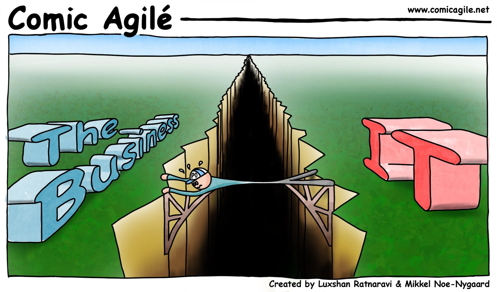

_We need to talk about value created using data: why organizations fail to deliver, and how to change that._

If you have been following data topics during the last months, you saw that the topic of the business value of building and maintaining data teams has been questioned a lot.

It notably stems from:

🧪 the (in)ability to deliver valuable products at a scale bigger than white-room POCs

which is mainly caused by

💩 the still unresolved issue of getting and consolidating trustworthy data

all of it being based on both

🗯️ the lack of alignment / understanding / communication between business and tech teams

and the even larger topic of

📖 the lack of proper knowledge management in most organizations

<figure><figcaption style="margin-top: 0px"><em><a href="https://www.comicagile.net/comic/bridging-the-gap/">Bridging the Gap by Comic Agilé</a></em></figcaption></figure>

I have been thinking about writing things down about this for a long time, and would like to start getting into some content and conversations.

I would like to help on 3 axes:

- Tell tech teams what the business needs and why, and vice versa
    
- Build on real world business issues and read them from a business perspective as well as tech perspective
    
- Digest these into actionable tips and tools for Chief Data Officers
    
This is HUGE and I am not going to explore this in a structured, encyclopedic way. Way more from chains of thought, opportunities, events... and feedback! I would love your support - from business and tech alike - in the form of feedback, questions, anecdotes from your own experience.

I see it take multiple forms:

📨 This newsletter "Data Partners" would be the main repository for long form, polished content. As the name suggests, it is targeted for business and tech people alike, because they should work as partners!

That’s where you are! Just subscribe if you didn’t already:

💬 LinkedIn for conversations about the topics raised in the newsletter. [Follow me there!](https://www.linkedin.com/in/gansanay/)

🔧 An "open door garage" to see ideas in the making (and even collaborate if you fancy!). This happens on [my personal website](https://gansanay.com/).

Let's start this up! What is a meaningful anecdote you had on the relationship between business and tech people? Any topics you would like to see me address?