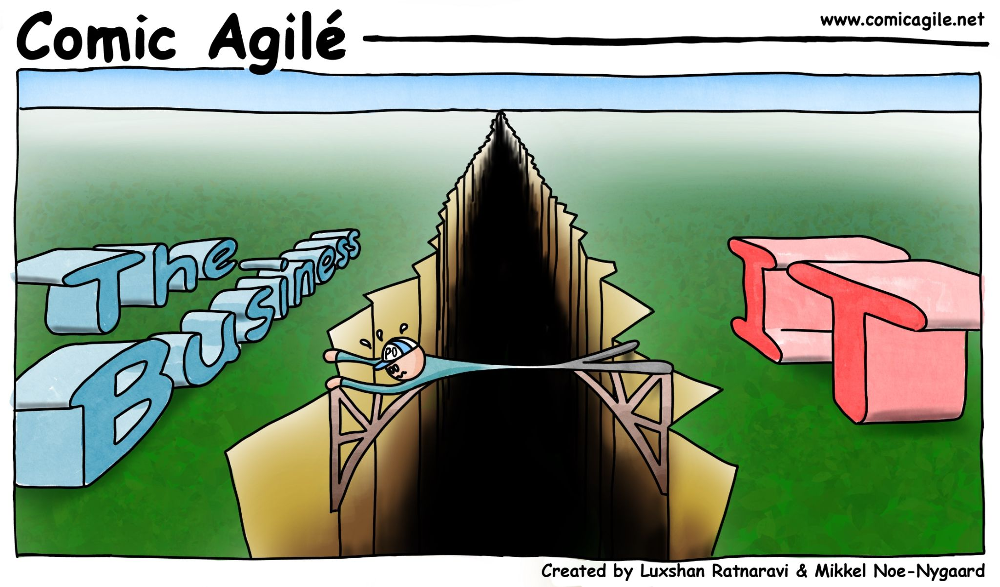

*When facing the entirety of an organization's activities, the unexpected is often a daily occurrence. Ad hoc requests can be perceived by technical teams as a threat: unplanned, urgent, often lacking context, they disrupt the planned progress of ongoing projects.*

*In this first article on the subject of ad hoc requests, I explain **why ad hoc queries are underutilized and poorly experienced**, and **how we should reconsider the qualification of requests** to transform them into a space for knowledge transmission and sharing between business and technology.*

*In a second article, I will explain **how different types of requests can be distinguished and leveraged** to both provide more value and streamline the associated workload.*

## *Ad hoc* requests fail right from the translation of the business need

The typical process is as follows:

1. **A business question arises**, stemming from recent results, awareness of a trend, a new business context... Its urgency varies depending on these situations.
2. **The business translates it into a data need**
3. **A data extraction request lands** in the data teams as an extraction request, not always contextualized, and often poorly received.

The crux of the problem lies in the second step, where the initial question is translated. Between the business and the technical side, each generally knows only a part of the reality:
* **The business knows its problem**, but doesn't know exactly what data is available and under what constraints. It also doesn't always formulate the underlying assumptions of its question, which the technical side needs in order to respond.
* **The technical side knows what data is available** and how it's organized but might not know the business topic well enough to connect it with a previous request, to fill in or suggest the missing assumptions in the request.

## The lack of knowledge sharing leads to loss of trust and value

Neither side truly takes the time to put themselves in the other's shoes, and the exchanges between the two gradually become transactional. Instead of sharing the business problem, a specification must be provided, written in language that is difficult for the business to grasp. If the result doesn't meet expectations, the specification is presented as evidence that the request was poorly defined. In the best cases, the cycle restarts until the right solution is found, and this costs everyone a significant amount of time.

Over time, after a few requests, what will the natural reaction of the business be?
* **Proceeding without data**, and disconnecting from fact-based decision-making
* **Making far fewer requests**, consolidating all their needs into a mega-request for a massive extraction, which they will then struggle with in Excel
* **Transitioning all data to a third-party SaaS solution** that offers to leverage their data and resell it in the form of dashboards and studies.

## Let's move beyond ticketing and find a new mode of exchange

The key to escaping this situation is to capitalize on the need qualification stage as an opportunity for the transfer of *data literacy* to the business and *business literacy* to the technical side.

Many questions will arise at the start, but as requests are repeated, each party will become more knowledgeable about the other's domain, and it's not difficult to bet that many difficulties will naturally be resolved quickly.

## "Isn't this the role of the Product Owner?"

In a context where roles are over-specialized and responsibilities are meticulously divided, it's challenging to create this dual *literacy* transfer between the teams. Often, the responsibility of expressing the business need falls to a (Proxy) Product Owner."

<figure><figcaption style="margin-top: 0px"><em>The comfortable role of the (Proxy) Product Owner - <a href="https://www.comicagile.net/comic/bridging-the-gap/">Bridging the Gap by Comic Agilé</a></em></figcaption></figure>

Without succumbing to the temptation of saying that everyone is involved and that success or failure belongs to all, we can at least consider that while some ad hoc requests might resemble early-stage products, it's not appropriate to impose a *framework* onto ad hoc requests, but rather to recognize them as an opportunity for sharing.
## But how to handle all these requests?

A data team should always be seen as available to address ad hoc requests... while making sure not to end up overloaded! In an upcoming article, I will propose a way to differentiate requests to better highlight their value and incorporate the corresponding effort into projects that are easier to plan.